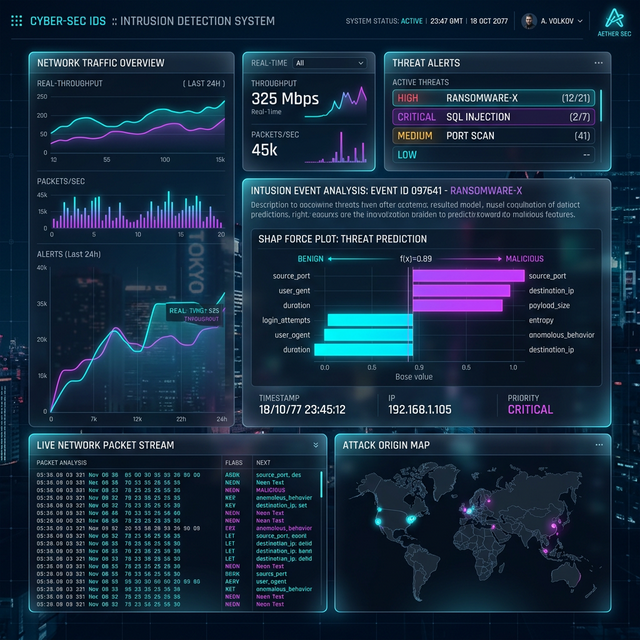

# Interpretable Intrusion Detection System Using Explainable AI for IoT Networks

 

*(Concept illustrative screenshot of the UI design)*

Traditional Intrusion Detection Systems (IDS) are like "black boxes"—they don't explain why they flag something as a threat. This project uses **Explainable AI (SHAP)** to show you the exact reasons behind every security alert. 

Flagged threats are explained with simple visual clues, helping security teams understand if a detection is a real attack or just a regular network event.

---

## 🛠️ Prerequisites
Before starting, ensure you have the following installed:
- **Python 3.10+** (Backend)
- **Node.js 18+** (Frontend)
- **⚠️ NCAP Driver**: Mandatory for Live Monitoring.
  - **Windows**: [Download Npcap](https://npcap.com/#download) (Select "WinPcap API-compatible Mode").
  - **Linux**: `sudo apt install libpcap-dev`.

## 🏗️ Architecture Stack
This project features a decoupled, scalable architecture containing three primary pillars:

### 1. Machine Learning Core 🧠
- **Model**: Trained XGBoost Classifier optimized for precision.
- **Explainability Frame**: Leverages `shap.Explainer` to interpret features instantly per prediction.
- **Preprocessing Engine**: Dynamic `pandas` scaler mapping string columns dynamically and safely.

### 2. Backend Engine (FastAPI) ⚙️
- **Framework**: High-performance asynchronous API using Python's FastAPI.
- **Authentication**: JWT Authorization (OAuth2 wrapper) locking down execution endpoints.
- **Storage**: Integrated with MongoDB / SQLite (configurable via `.env`) mapping logs via SQL Alchemy.

### 3. Frontend Dashboard (React + Vite) 🎨
- **UI Structure**: Lightning-fast Single Page Application (SPA).
- **Aesthetics**: Complete "Cyber AI" custom theme featuring extensive **Glassmorphism**, floating geometric CSS animations, neon borders, and dark-modes natively integrated via Tailwind CSS & Framer Motion.
- **Analytics Visualizer**: Beautifully parsed history logs dynamically charted and tabled.

---

## 🔥 Key Features
- **User Operator UI:** Allows users to execute analyses on captured network flows dynamically by uploading a `.csv` traffic dump. The system executes anomaly extraction.
- **Real-Time SHAP Generation:** Computes custom baseline and SHAP Force representations to highlight *EXACTLY* which network features mathematically defined the packet as an Attack.
- **Animated Interface Design:** Dynamic rendering, neon glowing vectors, and geometric data streams embedded natively to improve user immersion.
- **Role-Based Auth System:** Initial registrant automatically inherits Admin credentials, providing isolated telemetry views from standard diagnostic users.

---

## 📂 Folder Structure

```text
IDS_XAI_Project/
│
├── backend/
│   ├── app/
│   │   ├── main.py
│   │   ├── database.py
│   │   ├── models/        (DB Models)
│   │   ├── routes/        (API Authentication & Predict Endpoints)
│   │   ├── utils/         (XGBoost Handlers & Preprocessing tools)
│   │   └── schemas/       (Pydantic Parsers)
│   ├── requirements.txt
│   └── .env               (JWT Tokens & Mongo URIs)
│
├── frontend/
│   ├── src/
│   │   ├── components/    (Navigation, Auth, UI Elements)
│   │   ├── pages/         (React Routing Pages: Landing, Dashboard)
│   │   ├── services/      (Axios Interceptor handlers)
│   │   └── index.css      (Tailwind Custom Injectables)
│   ├── public/
│   └── tailwind.config.js
│
├── models/                (joblib binaries & feature matchings)
├── dataset/               (UNSW-NB15 file extracts)
├── src/                   (Jupyter preprocessing playground)
└── README.md
```

---

## 🚀 How to Run the Ecosystem Locally

### 1. Initiate Backend API (FastAPI)
Change your working directory to the `backend` folder and start the `uvicorn` server:
```bash
cd backend
python -m venv venv          # Initialize a virtual environment
source venv/bin/activate     # Activate it (Windows: venv\Scripts\activate)
pip install -r requirements.txt
python -m uvicorn app.main:app --host 0.0.0.0 --port 8000 --reload
```
*The API should now be running on http://127.0.0.1:8000/docs*

### ⚠️ IMPORTANT: Live Monitor Setup
To use the **Live Monitoring** feature, you must install a packet capture driver on your computer:
1.  **Windows**: Download and install [Npcap](https://npcap.com/#download). (Check the box "Install Npcap in WinPcap API-compatible Mode" during setup).
2.  **Linux**: Install `libpcap` using your terminal: `sudo apt-get install libpcap-dev`.

### 2. Start the Frontend (Web Dashboard)
Open a new terminal session, navigate to the `frontend` directory, and start the node server:
```bash
cd frontend
npm install
npm run dev
```
*The Dashboard will launch locally on Vite's default URL (http://localhost:5173).*

### 3. Setup Flow
1. Navigate to the frontend web UI.
2. Register an account. The **first** user to `Register` naturally becomes the platform `ADMIN` / High-level Operator.
3. Access the dashboard, upload the `UNSW_NB15_testing-set.csv` to witness the engine dynamically slice a random anomalous string of features and interpret the cybersecurity threat!

---

## 🔭 Future Work
- Integration with live raw PCAP stream parsing via `Scapy` to pipe physical network card monitoring directly to the API in real time.
- Deep Learning modules incorporating `DeepSHAP` alongside sequence monitoring Recurrent Neural Network (RNN) structure for temporally dispersed DOS flooding.
